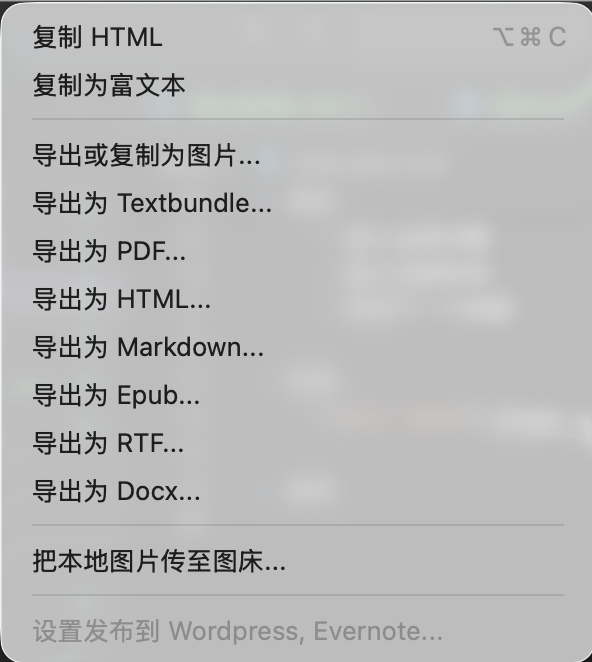
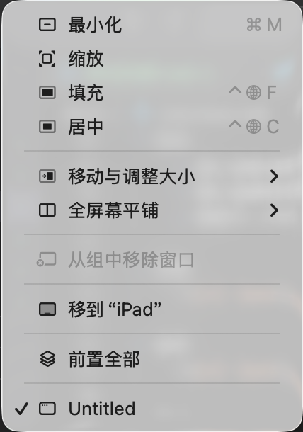

这里是menu bar应该显示的内容：

- 云简
    - 关于云简 
    - 设置
    - 隐藏云简
    - 隐藏其他
    - 显示所有
    - 退出云简

- 文件
    - 新建
    - 打开
    - 打开最近文件...
    - 保存
    - 另存为
    - 关闭
    - 关闭当前窗口
    - 新窗口打开
    - 在Finder中显示
    - 页面设置
    - 打印

- 编辑
    - 撤销
    - 重做
    - 剪切
    - 复制
    - 复制为富文本
    - 粘贴
    - 粘贴为PNG
    - 粘贴为纯文本
    - 将html粘贴为markdown
    - 删除
    - 全选
    - 在中文和半角的英文、数字之间插入空格
    - 插入html实体
    - 查找
    - 拼写和语法
    - 替换
    - 转换
    - 语音
    - 自动填充
    - 开始听写
    - 表情和符号
- 语法
    - 加醋
    - 斜体
    - 下划线
    - 删除线
    - 链接
    - 插入图片语法
    - 插入图片或文件
    - 表格
    - 无序列表
    - 有序列表
    - 任务列表
    - 引用
    - 行内代码
    - 代码块
    - 行内数学公式
    - 数学公式块
    - 行分隔符
    - html注释
    - 标题1～6
    - 向右缩进
    - 向左缩进
    - 新段落
    - 插入当前日期
    - 插入当前时间
    - 转到下一个标签

- 视图
    

- 发布
    

- 窗口
    

- 帮助
    